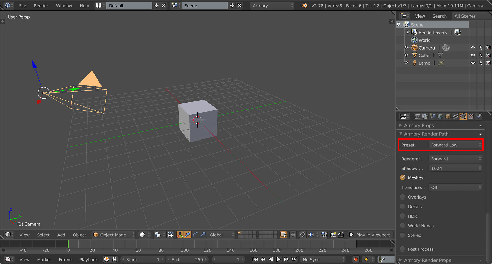
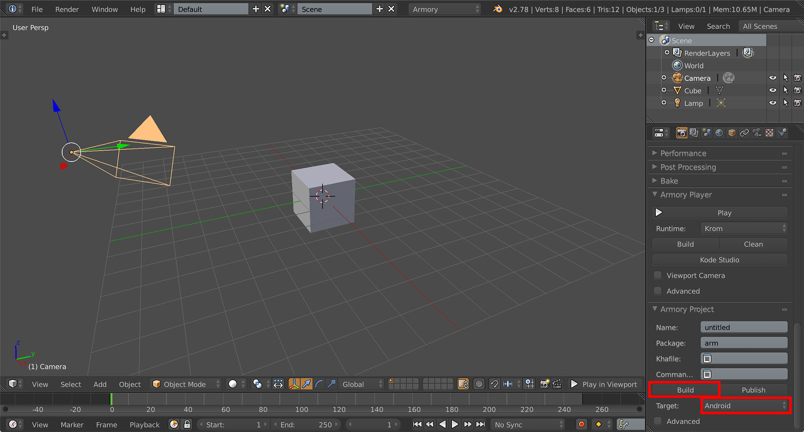
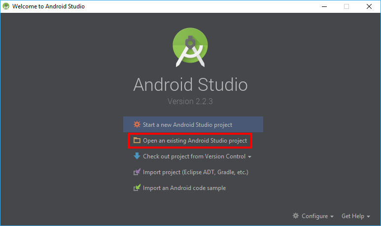
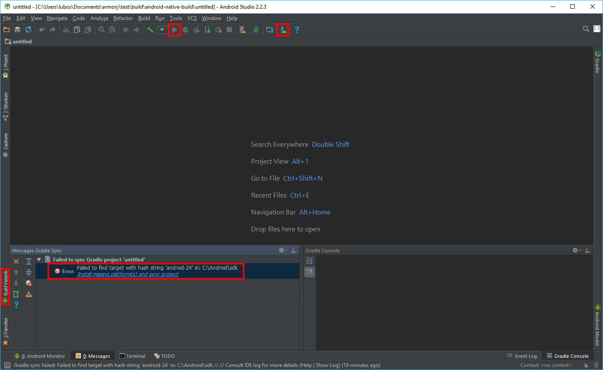

# Contents

This section covers Android specific topics.

# Building for Android

Before running on mobile device, make sure the project is optimized to run smooth on your target hardware. It is recommended to select *Forward Low* preset in  *Camera - Properties - Camera Data - Armory Render Path*. Additionally, simplifying **materials, textures and geometry** may be needed.

## Krom

TBD

## Native (C++)

Select *Android* in *Properties - Render - Armory Project - Target*. Hit *Build* to generate android project files.

To proceed, install and run [Android Studio](https://developer.android.com/studio/index.html). Select *Open an existing Android Studio project*. The project is located at *your_blend_file_location/build/android-native-build/your_project_name*

Once the project is loaded, make sure to install *NDK* by opening up *SDK Manager - SDK Tools* from Android Studio.

Android Studio may ask you to install additional tools. Continue till you resolve all dependencies. **Connect your device** and press *Run*. Build process can take up to several minutes when compiling for the first time. You may speed it up by selecting a specific platform from *Build Variants* menu.

Once compiled, the project will launch on your device!
